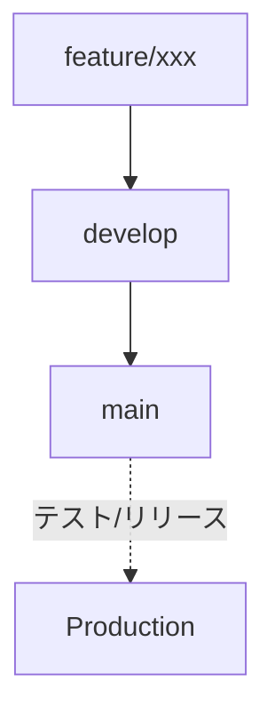

# 映画サークル ホームページ

このREADMEはChatGPTで生成しています。

このリポジトリは、映画サークルのホームページを開発・管理するためのものです。以下の情報をもとに、プロジェクトのセットアップや開発ルールをまとめています。

---

## 目次

1. [プロジェクト概要](#プロジェクト概要)
2. [技術スタック](#技術スタック)
3. [事前準備](#事前準備)
4. [セットアップ手順](#セットアップ手順)
5. [開発用コンテナ（.devcontainer）](#開発用コンテナdevcontainer)
6. [スクリプト一覧](#スクリプト一覧)
7. [フォルダ構成・命名規則](#フォルダ構成命名規則)
   - [コンポーネント作成ルール](#コンポーネント作成ルール)
   - [プロジェクトルート例](#プロジェクトルート例)
8. [ブランチ戦略](#ブランチ戦略)
9. [コントリビューション](#コントリビューション)
10. [ライセンス](#ライセンス)

---

## プロジェクト概要

映画サークルのホームページです。

以下の機能を備えます。

- 未定

---

## 技術スタック

- **Node.js**: v22
- **Next.js**: v15
- **React**: v19
- **Tailwind CSS**: v4
- **TypeScript**
- **パッケージマネージャ**: npm

これらを組み合わせることで、モダンなフロントエンド開発を行います。

---

## 事前準備

本リポジトリをクローンしてローカル環境で開発を始める前に、以下を用意してください。

1. **Node.js (v22)**
   - インストール方法は公式サイトや `nvm` などを使用してバージョンを切り替えてください。
2. **npm**
   - Node.js をインストールすると同時に付属しています。
3. **VSCode などのエディタ（推奨）**
   - 開発用コンテナ（.devcontainer）を利用する場合は、Docker が動作する環境が必要です。

※devcontainerを使用する場合1、2は不要です。

---

## セットアップ手順

```bash
# リポジトリをクローン
git clone https://github.com/BlackBathRoom/movie-circle-homepage.git
cd movie-circle-website
```

### Dev Containerを利用しない場合

```bash
# 依存関係のインストール
npm install

# 開発サーバー起動
npm run dev
```

- `npm install` によって、必要なパッケージが `node_modules` にインストールされます。
- `npm run dev` で Next.js の開発サーバーが起動し、ブラウザで http://localhost:3000 を開くとアプリケーションを確認できます。

---

### Dev Containerを利用する場合

本プロジェクトには `.devcontainer` が設定済みのため、VSCode と Docker がインストール済みの場合は以下の手順でそのままコンテナ内で開発できます。

1. VSCode を開き、左下の「リモートウィンドウ」アイコン → 「Remote-Containers: Open Folder in Container...」 を選択
2. リポジトリルートを選択して開く
3. 自動的に Docker コンテナがビルドされ、開発環境が立ち上がります
4. コンテナ内ターミナルで `npm run dev` を実行して開発を開始してください

---

## フォルダ構成（一部抜粋）・命名規則

```
movie-circle-website/
├── .devcontainer/            # 開発用コンテナ設定
├── public/                   # 画像や静的ファイル
├── src/
│   ├── components/           # 再利用可能な UI コンポーネント群
│   ├── app/                # Next.js のページ (App Router)
│   ├── styles/               # グローバルスタイルや Tailwind 設定
│   │   └── globals.css
│   └── lib/                # ユーティリティ関数や共通ロジック
├── eslint.config.js          # ESLint 設定
├── .prettierrc               # Prettier 設定
├── next.config.ts            # Next.js 設定
├── tsconfig.json             # TypeScript 設定
└── package.json              # 依存関係とスクリプト
```

### コンポーネント作成ルール

- **フォルダベースのコンポーネント構成**（通称: コンポーネントフォルダパターン）を採用します。
  - 新しいコンポーネントを作る際は、`src/components/` 配下に新しいフォルダを作成し、その中に `index.tsx` を置くようにしてください。
  - 例: `src/components/Header/index.tsx`, `src/components/Footer/index.tsx` など。
  - スタイルやテストがある場合は同じフォルダにまとめられます。
- **命名規則**
  - フォルダ名およびコンポーネント名は PascalCase（先頭大文字のキャメルケース）とします。
  - 例: `MovieCard/index.tsx` 内で `export default function MovieCard() { … }` とします。

---

## ブランチ戦略

- `main`
  - 本番用ブランチです。
  - 常にデプロイ可能な状態を保ちます。
  - 本番リリースに必要な変更のみマージします。
- `develop`
  - 開発用ブランチです。日々の開発や機能追加はすべてここで行います。
  - 一定のマイルストーンや機能完成時に `main` へマージ（リリース）します。



- 必要に応じて `feature/xxx` や `fix/xxx` といったブランチを切り、コードレビュー後に `develop` にマージしてください。

---

## コントリビューション

1. リポジトリを Clone し、自分の環境で作業を開始します。
2. ブランチは `feature/xxx` や `fix/xxx` のように命名してください。
3. コーディングが完了したら、プルリクエストを作成し、必ず以下の項目をチェックリストとして記載してください。
   - [ ] ビルドが成功している (`npm run build`)
   - [ ] ESLint に違反がない (`npm run lint`)
   - [ ] Prettier でフォーマット済み (`npm run format`)
   - [ ] 動作確認を行った (ブラウザ表示やコンソールエラーの確認など)
4. コードレビューを経て、開発チームの承認が得られたら `develop` ブランチへマージします。
5. 開発完了やリリース準備が整ったら、`develop` から `main` へプルリクエストを作成し、必要なテスト・レビューを行います。
